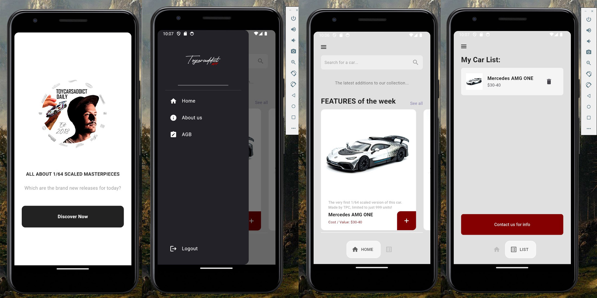
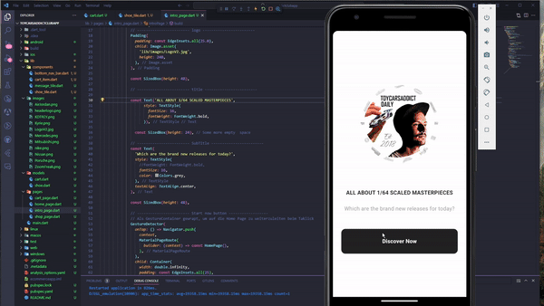
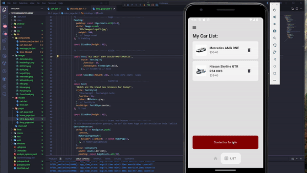
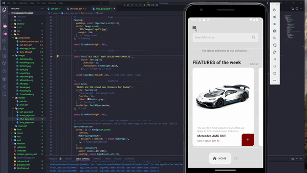

    

***

# &nbsp; Toycarsaddict Newsletter Diecast App with Flutter

**A little nerve-wracking Flutter project that I created for the ASP at SAE Zurich as part of my bachelor's degree. This is my first programming experience with Flutter and Dart. This is just a DEMO APP and hasnt been officially launched on the App-Store or Android-Store yet!**

 **Download the E-LEARNING PDF here:**

  
  

## All about the Mobile App

 **Explained in a Nutshell:**
* I've decided to create a cross-platform app because I wanted to be able to test the app on both Android and iOS devices 
* The app is written in Dart and uses the Flutter framework 
* I've chosen Flutter over React Native because I wanted to learn something completely new and I already have a book on Flutter at home.

**What's the meaning behind the App?**
* The app is structured in such a way that new model cars are regularly published in a featured section > The cars are part of our collection but can also be purchased in the shop > You put the cars you would like to have on a list > As soon as all the cars are added to your list, you can send us a message with your request

## 1) Enter the App by an Intro Page

> Once you've started the App, you see this homescreen which welcomes you. Then you can click on the "Discover Now"-Button to enter the app.

 

 ## 2) Scroll through the Featured list

> The featured section will show you the latest model cars that have been added to our collection. These are brand new releases and are able to purchase in the shop while it stocks last. You can swipe through, each car has a description, title and average price. You got also a search bar on top if you are looking for a specific car. The app is not connected to a database, so the search bar is just a dummy version without any function.

 

## 3) Add the cars you want to your list

> Swipe through the featured section and add the cars you want by touching the red plus button. You will get a green success message if the car has been added to your list. On the bottom you can switch between the home secttion and list section. On the list section you can see all the cars you have added for your possible purchase.

 

## 4) Contact us with your list or delete it

> Once you have added all the cars you want to your list, you can send us a message with your request if the cars are available or if there is a chance to make another order / reservation by clicking the red "contact us for info"-button.The app is not connected to a database, so this button is just a dummy. If you have decided to not purchase the cars, you can delete the cars one by one by touching the bin icon. You will get a red info message if the car has been successfully deleted from your list.
 

## 5) Discover the aside menu

> By clicking the burger menu you will see an aside section with the official logo and some more options such as a home-button, an about us section, our AGB and the possibility to logout. The app is not connected to a database, so the logout button is just a dummy version such as all the other buttons of the aside menu.
 

## Want to do your own Flutter Project?

This project is a starting point for a Flutter application.

A few resources to get you started if this is your first Flutter project:

- [Lab: Write your first Flutter app](https://docs.flutter.dev/get-started/codelab)
- [Cookbook: Useful Flutter samples](https://docs.flutter.dev/cookbook)

For help getting started with Flutter development, view the
[online documentation](https://docs.flutter.dev/), which offers tutorials,
samples, guidance on mobile development, and a full API reference.

